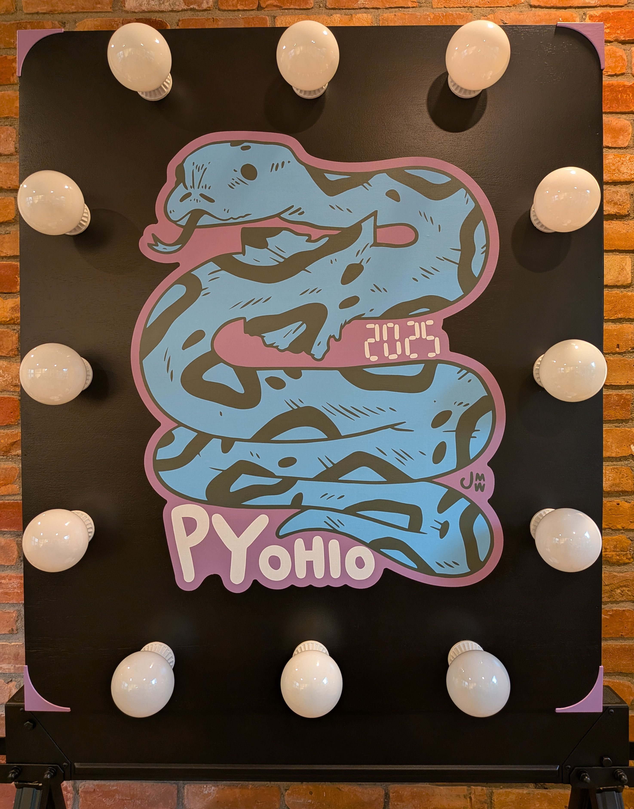
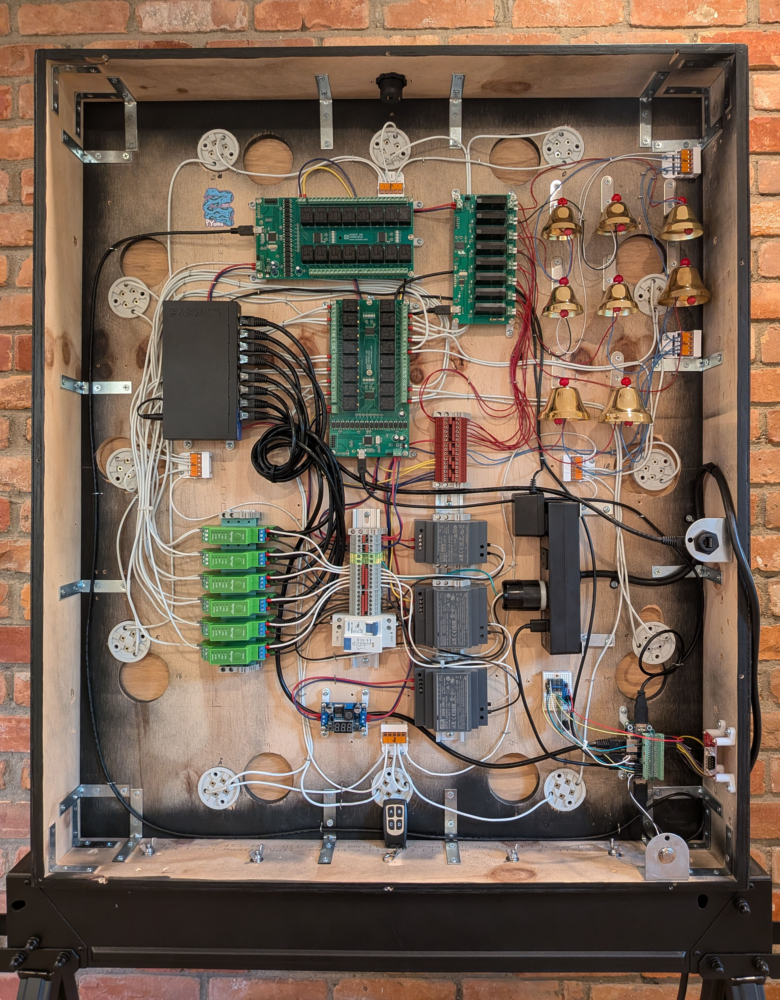
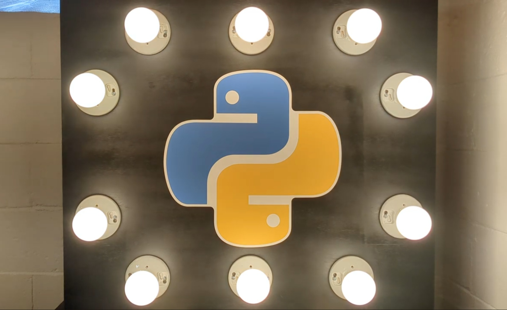
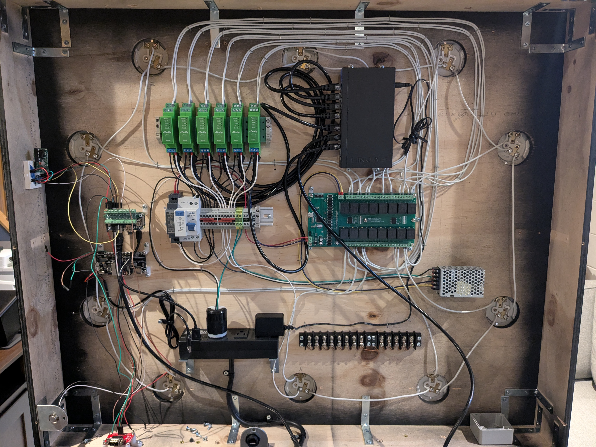
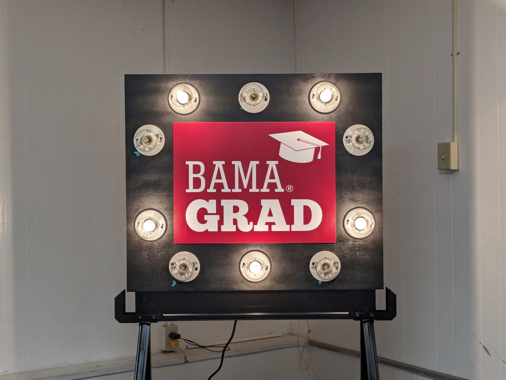
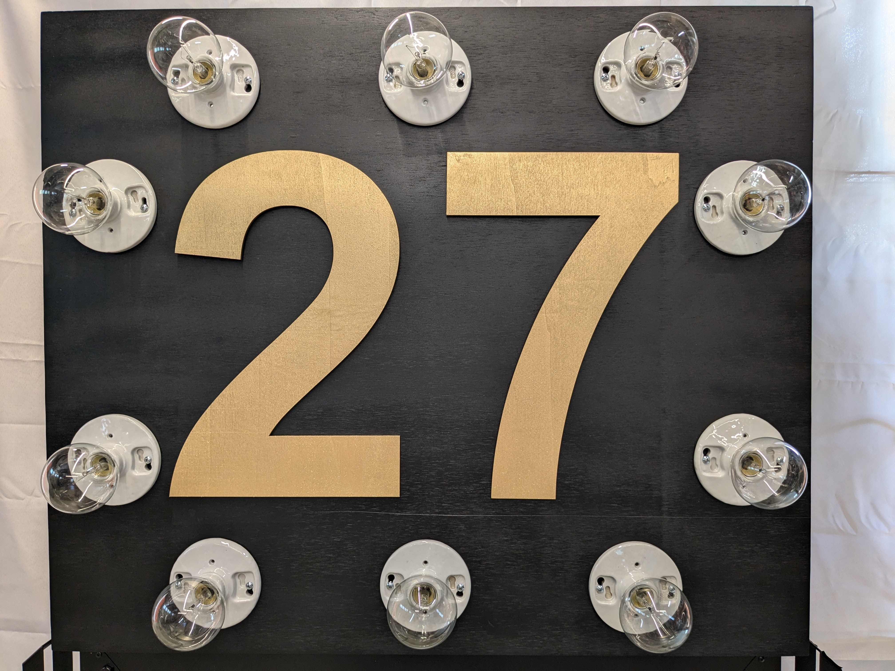

**Marquee animated sign project**

I had wanted to make this project for a while, and our son's graduation from the University Alabama was the excuse I needed.  
While the Raspberry Pi and other electronics are relatively modern, the incandescent bulbs and ceramic lamp holders give it a retro feel, as do the mechanical relays, whose clicks resonate in the wooden cabinet.  Adding the mechanical bells allowed me to fold in another project from my backlog. 

<b>Version 4.0.0, [which I presented at PyOhio 2025](https://www.youtube.com/watch?v=-3euk5EPddU), includes the following:</b>
* Upgraded to 12 lights, including a new front face and new aesthetically pleasing light fixtures.
* Added musical bells, with supporting relay board and power supplies.
* Added the Signs performance, as shown in the above video.
* Added auto mode, allowing a selection of modes to be cycled through automatically.

<figure>
<figcaption><b>Version 4 front and internals</b></figcaption>

</figure>

  

Version 3.0.0 represented a substantial amount of hardware and software work, including the following:
* Added dimmers, allowing independent control of each bulb's brightness.
* Added new Dimmer, Executor and Mode classes.
* Added a 4-button remote control and receiver.
* Revamped the wiring and electrical components.

Version 3 demo video

<figure>
<figcaption>Version 3 internals</figcaption>

</figure>

Version 2.2.0 included the following:
* Moved most of the main application code into the new class Player.
* Added the initial fetching and subsequent tracking of the state of the lights.
* Added random light sequences, along with a new mode random_flip that utilizes the new state tracking feature.

Version 2.1.0 included the following:
* Command-line specification of the initial mode.
* Command-line specification of a light pattern.  If specified, the application will set the lights accordingly and then exit.

Version 2.0.0 included the following:
* Added a button to the back of the cabinet to allow the operator to change modes at any time.
* Added an RS-232 port for easy Raspberry Pi console access.
* Reworked the code rather extensively.

<figure>
<figcaption>Our son's graduation</figcaption>

</figure>

<figure>
<figcaption>Our 27th wedding anniversary</figcaption>

</figure>

<figure>
<figcaption>Version 2 internals</figcaption>

</figure>
  
<figure>
<figcaption>Version 2 externals</figcaption>

</figure>
