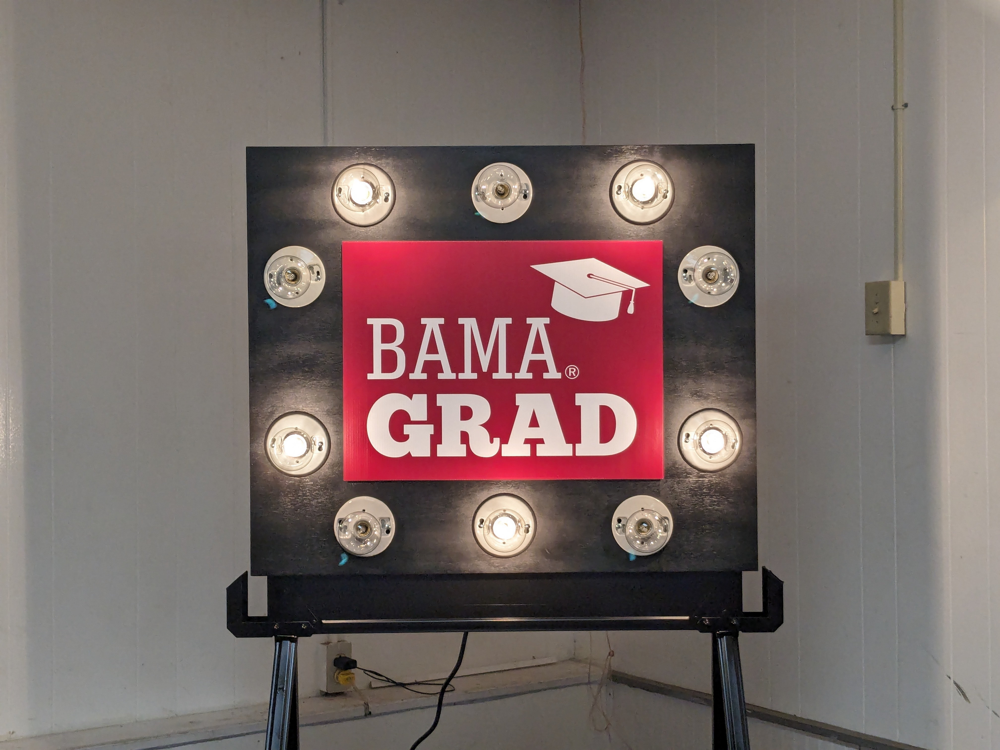

**Marquee semi-retro lighted sign probject**

I had wanted to make this project for a while, and my son's graduation from University Alabama was the excuse I needed.  
As a bonus, I got to use my table saw for the first time!  
While the relay board and Raspberry Pi are relatively modern, the incandescent bulbs and ceramic lamp holders give it a retro feel, as do the mechanical relays, which make a variety of percussive sounds, and resonate in the wooden cabinet in a musical way.  

