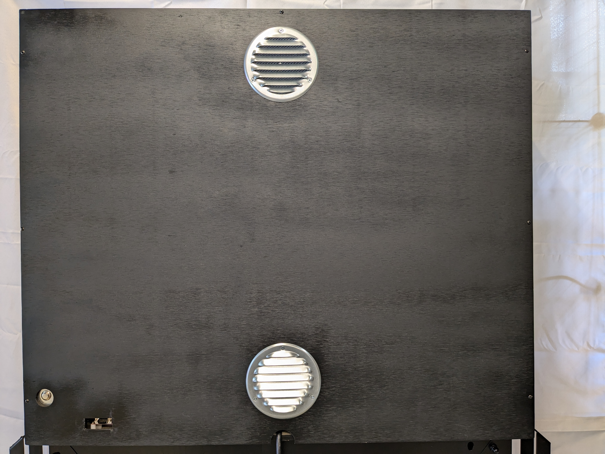

**Marquee semi-retro lighted sign project**

I have wanted to make this project for a while, and our son's graduation from the University Alabama was the excuse I needed.  
As a bonus, I got to use my table saw for the first time!  
While the relay board and Raspberry Pi are relatively modern, the incandescent bulbs and ceramic lamp holders give it a retro feel, as do the mechanical relays, whose mechanical clicks resonate in the wooden cabinet. 

Shortly after our son's graduation came our 27th wedding anniversary, hence the large gold numerals.

Version 2.2.0 includes the following:
* Moved most of the main application code into the new class Player.
* Added the initial fetching and subsequent tracking of the state of the lights.
* Added random light sequences, along with a new mode random_flip that utilizes the new state tracking feature.

Version 2.1.0 includes the following:
* Command-line specification of the initial mode.
* Command-line specification of a light pattern.  If specified, the application will set the lights accordingly and then exit.

Version 2.0.0 includes the following:
* Added a button to the back of the cabinet to allow the operator to change modes at any time.
* Added an RS-232 port for easy Raspberry Pi console access.
* Reworked the code rather extensively.

<figure>
<figcaption>Our son's graduation!</figcaption>

</figure>

<figure>
<figcaption>Our 27th wedding anniversary!</figcaption>

</figure>

<figure>
<figcaption>Version 2 internals</figcaption>

</figure>
  
<figure>
<figcaption>Version 2 externals</figcaption>

</figure>

https://github.com/mjmccaffrey/marquee/assets/7252610/bfa72967-be31-4cb4-8be4-53c1f20f6afa
